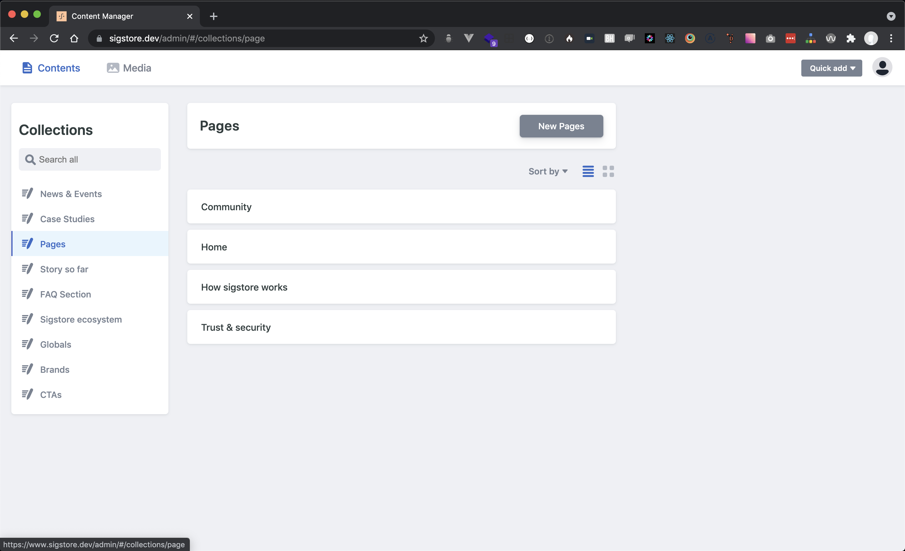
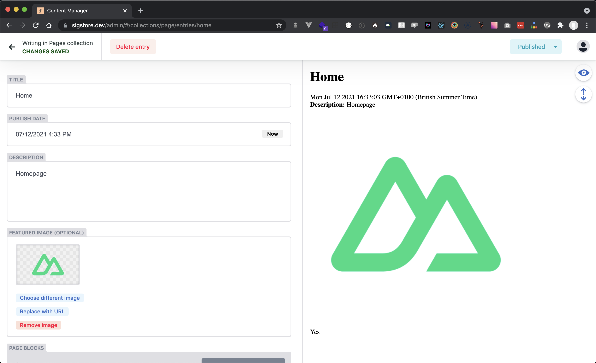
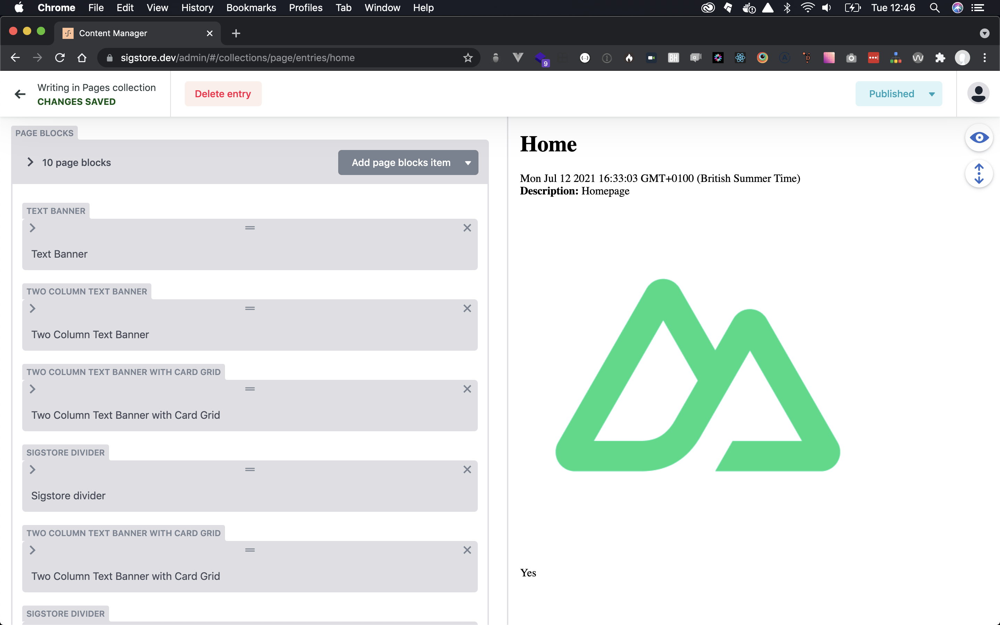
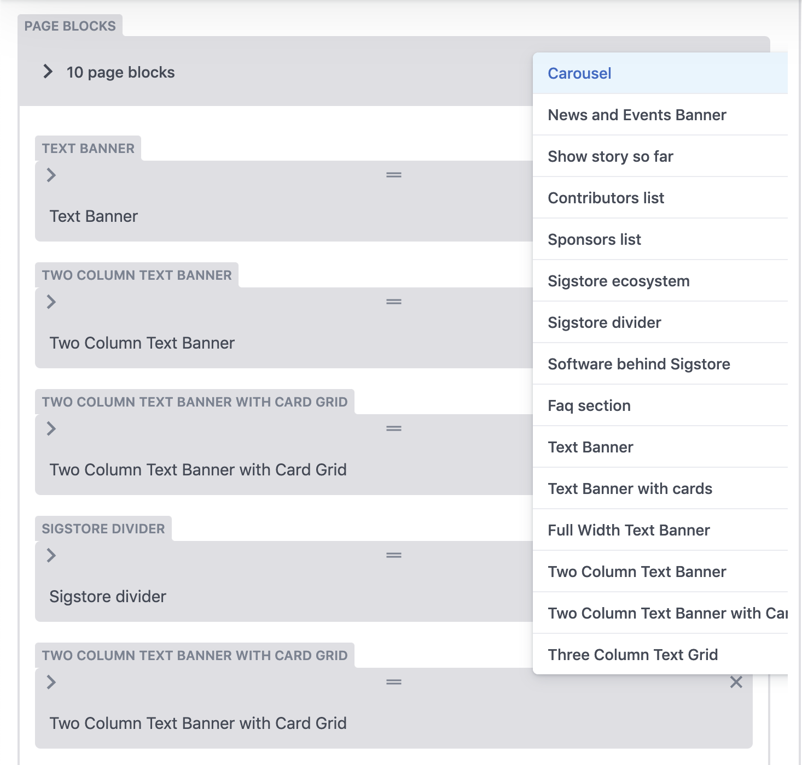
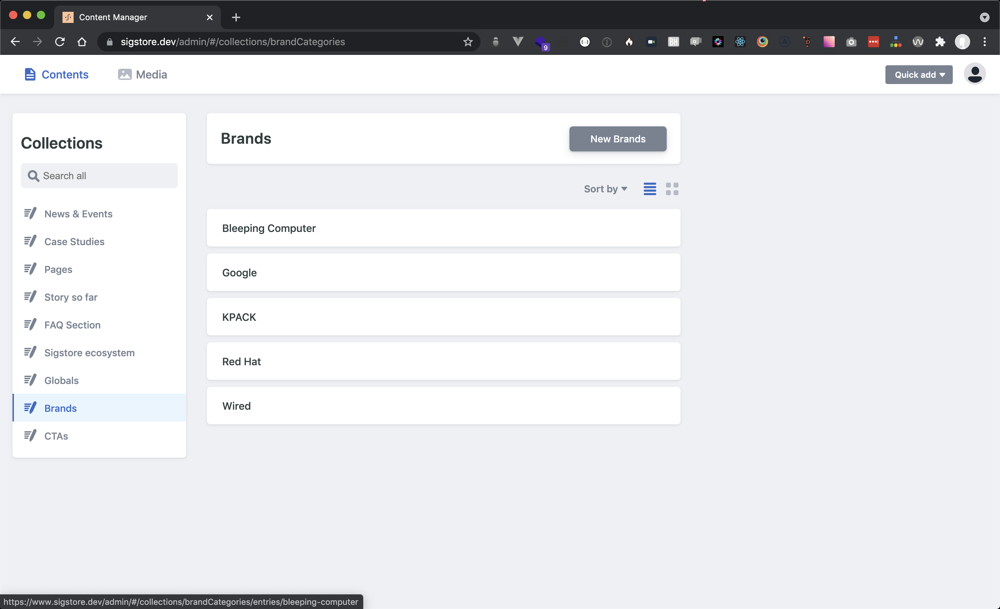
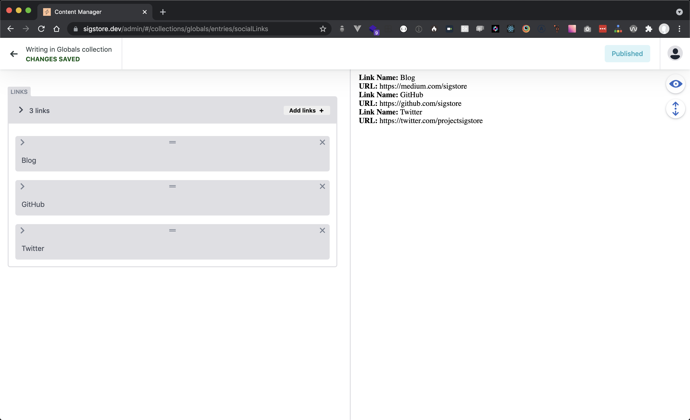

# sigstore CMS guidelines

## Overview

Netlify CMS is open source and it allows us to create content that is markdown centric so we can edit and change content easily through the CMS or through .md files directly.

There is a process to go through when editing content. Right now any content that is edited gets pushed directly to the `develop` branch on the main sigstore website repo which is here: https://github.com/sigstore/sigstore-website. Upon this being pushed to the branch above it can then be approved and merged to `main`.

Read more about Netlify CMS below to dig into the docs:

https://www.netlifycms.org/

## Authentication and login

To log into the CMS you need to be invited through main admin users via Netlify identity to access the CMS itself. Once you have gone through the necessary steps to creating and verifying your account you can go in and start editing content.

https://docs.netlify.com/visitor-access/identity/

1.  Go to the admin page by visiting this url https://sigstore.dev/admin where you will be greeted by a login screen
2.  Enter your email address and password you used to set the account up.
3.  Once you have added the correct details you can start exploring the different sections of the CMS on the left menu bar.

### Log in screen

### Add credentials

### Editing via CMS

This is the preferred way of editing content of the site. There is much more control over what you are editing and you can use the schema we created for it in a much clearer way.
 
1. Navigate to content you would like to edit in the CMS eg, Case Studies.
2. Edit a post or create a new entry within this collection.
3. Once you are happy with the content, hit 'Publish' in the top right. This will generate a commit to the `develop` branch where it will create a deploy preview on netlify on this url: https://clever-cray-18c671.netlify.app.
4. You can preview and check any edits on here before allowing this to be merged into the `main` branch.

### Editing via .md files

⚠️ ⚠️ ⚠️ ⚠️ ⚠️ ⚠️ ⚠️ ⚠️ ⚠️ ⚠️ ⚠️ ⚠️ ⚠️ ⚠️ ⚠️ ⚠️ Warning ⚠️ ⚠️ ⚠️ ⚠️ ⚠️ ⚠️ ⚠️ ⚠️ ⚠️ ⚠️ ⚠️ ⚠️ ⚠️ ⚠️ ⚠️ ⚠️

This is not the preferred way of editing content but if that is what you want to do then please follow these steps below:

**via GitHub:**

1. Go to the sigstore repo here: https://github.com/sigstore/sigstore-website.
2. Change the origin branch you are on so it points to `develop` NOT `main`.
3. Move into `/content` folder and inside here you can edit content in any of the subfolders.
4. Once you are happy to save changes, give the commit some detail, please commit those changes by ticking the bottom radio button **Create a new branch for this commit and start a pull request**.
5. This PR will then get merged once someone is happy on the team with the changes and you can check the progress on https://clever-cray-18c671.netlify.app.

## Pages

The pages of the CMS are made up of drag and drop components that are added when required. This enables us to create content rich pages throughout the site and it also means we can move away from the standard template look of a markdown created file. The output of the page is standard markdown but it leverages the use of frontmatter to build out the complex sections within the page itself.

#### Page item

## Page components

These are the items that live inside pages and can be used to build out the important structures within them. They are directly tied to the `components` directory in the main site and we dynamically load in these components from the front-end using the page block handle that is created.

#### Page blocks

To add a new section in a page, find the dropdown to the right and select a component then drag and drop/move into the position you want. When you are happy, hit 'Publish' in the top right.

Some of the components have related collections such as Brands. These can be then added to repeated items within the components such as Case Studies.

## Collections

The collections in the site are nested sets of content that can be repeated for things like menus, posts, lists and taxonomy.

Our main collections are Pages, News and Events, Case Studies and FAQs. These are the areas we populate the most and will have the most updates throughout the sigstore development.

## Media

Here is where you will add and edit all media for the site. You can add straight in here or when editing content in pages or sections you can add media in the Image widget that uploads straight to the media directory in the `static` folder.

## Globals

This area is split into 4 sections below:

#### Site Info

Some basic content on the site such as title, Description and some meta info regarding historic data about sigstore.

#### Social links

To add social links click 'Add links +' and create a new link to point to another social platform of your choice. these links can be used as a block of links or you can choose these links elsewhere as single elements.

#### Header

This is where you will generate the main navigation at the top of the site header area and where you will organise the order of the nav items.

#### Header menu

#### Header menu links

## Menu navigation

The menu navigation lives under globals but here we need to explain the menu and how it appears on the site.

- The menu items are added inside the Globals -> Header collection.
- The Header component uses the globals to expose the navigation items.
- The Page menu link is a relationship that uses the Pages slug to attach the correct url for routing to the right page.

## Publishing content

All content is published on the `develop` branch when you save it. That way we are not directly putting content straight into production.
